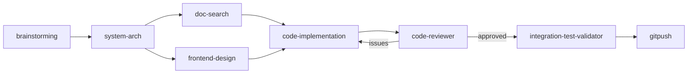

# public-skills

A collection of skills and agents for AI coding workflows. Works with **Claude Code**, **Codex**, and any agent that supports a skills directory.

Skills are modular, self-contained packages that extend your AI agent with specialized workflows — from safe git pushes to full implementation pipelines to automated screen recordings. Install the ones you need, skip the rest.

---

## Quick Start

```bash
git clone https://github.com/ashcastelinocs124/public-skills.git
cd public-skills
chmod +x setup.sh && ./setup.sh
```

`setup.sh` will:
1. Detect your agent (Claude Code or Codex) and ask where to install
2. Prompt for your GitHub username and email — personalizes skills so you never re-enter them
3. Copy all skills and agents to the right directory
4. Set your global `git config` if it isn't already

---

## Skills

### `skill-graph` — Dynamic Skill Pipeline Orchestration

Chain multiple skills into an ordered pipeline automatically. Describe a task, and skill-graph analyzes your entire skill library, selects the relevant skills, infers their ordering (via produces/consumes matching), renders a visual mermaid graph, gets your approval, then executes the pipeline.

**How it works:**
1. **Scan** — Two-pass discovery: reads frontmatter of all skills (cheap), then deep-reads only the relevant ones
2. **Classify** — Assigns each skill to a workflow phase (Explore → Design → Research → Build → Verify → Ship)
3. **Connect** — Infers edges from produces/consumes relationships, detects parallel branches and feedback loops
4. **Render** — Outputs a mermaid diagram + summary table + exclusion list
5. **Approve** — You review, tweak (add/remove/reorder), and approve
6. **Execute** — Runs the pipeline with context passing between skills and progress updates

```
/skill-graph "add Stripe payment processing to my SaaS app"
```



---

### `code-implementation` — Plan → Approve → Build → Review

Full implementation workflow with planning, approval gates, test-driven development, and code review. Dispatches fresh subagents per task with two-stage review (spec compliance + code quality).

```
/code-implementation "add user authentication with JWT"
```

**Features:**
- Scope questions before any work begins
- Plan with approval gate — no code until you approve
- TDD: write tests first, then implement
- Subagent-driven: fresh context per task, no pollution
- Two-stage review: spec compliance, then code quality
- Traceability tracking for large tasks

---

### `gitpush` — Safe GitHub Push

Push code with identity verification, sensitive file scanning, and confirmation gates at every step.

```
/gitpush
```

**Features:**
- Verifies git identity matches your GitHub account
- Scans for `.env`, credentials, secrets, keys — blocks them
- Auto-excludes `.claude/`, `CLAUDE.md`, `learnings.md`, `memory.md`, plan/spec files
- Branch selection with new branch option
- README check — create or update before pushing
- Optional screen recording for demo GIFs in README
- Deploy gate after push (Vercel, Railway, GitHub Pages, Netlify, Chrome Web Store)

---

### `screen-recording` — Automated Screen Recordings

Create polished screen recordings from a single prompt — automates browser or Mac app capture, dead-time trimming, smooth zooms, and gradient backgrounds.

```
/screen-recording "Record the login flow of my app"
```

**Features:**
- Browser recording via Steel Dev (headless Chrome)
- Mac app recording via native screencapture
- Remotion-based post-processing: trimming, zooms, gradient backgrounds
- Outputs MP4 or GIF ready for README embedding

---

### `capture-learnings` — Session Knowledge Extraction

Extract bugs fixed, gotchas discovered, architectural decisions, and patterns adopted from your coding session. Appends to `learnings.md` and cross-references against existing skills to suggest improvements.

```
/capture-learnings
```

**Features:**
- Reviews conversation for non-obvious insights
- Structured format: What / Why it matters / Fix or Pattern
- Cross-references learnings against skills to propose improvements
- Builds institutional knowledge that survives across sessions

---

### `skill-creator` — Build New Skills

Guide for creating effective skills from scratch. Covers structure, frontmatter, trigger design, workflow patterns, and testing.

```
/skill-creator "create a skill for database migrations"
```

---

### `skill-creator-v2` — Benchmark-Driven Skill Creation

Advanced skill creation with two modes:
- **Simple:** Quick interview → build SKILL.md → validate → done
- **Advanced:** Deep interview → web research → auto-generated test cases → A/B benchmark with isolated subagents → HTML comparison viewer → iterative improvement

```
/skill-creator-v2
```

---

### `find-skills` — Discover & Install Skills

Helps discover installable skills when you're looking for functionality. Searches available skill registries and suggests matches.

```
/find-skills "is there a skill for deploying to Vercel?"
```

---

## Agents

Sub-agents dispatched automatically by the skills above:

| Agent | What it does |
|-------|-------------|
| `code-implementation` | Heavy implementation — plans, checklists, TDD execution |
| `code-reviewer` | Validates implementation against plan and coding standards |
| `integration-test-validator` | Runs full test suite after code review passes |

---

## Manual Install

If you prefer not to use `setup.sh`:

**Claude Code (global — all projects):**
```bash
cp -r skills/gitpush ~/.claude/skills/
cp -r skills/code-implementation ~/.claude/skills/
cp -r skills/skill-graph ~/.claude/skills/
# repeat for any skills you want
cp agents/*.md ~/.claude/agents/
```

**Claude Code (project-only):**
```bash
cp -r skills/skill-graph .claude/skills/
```

**Codex:**
```bash
cp -r skills/* ~/.agents/skills/
cp agents/*.md ~/.agents/agents/
```

Then open any `SKILL.md` that contains `YOUR_GITHUB_USERNAME` or `YOUR_EMAIL` and replace with your own values.

---

## Configuring a Skill

Each skill that needs personal info (like `gitpush`) has a **Configuration** block at the top of its `SKILL.md`. If you ran `setup.sh` these are already filled in. To update them manually:

```bash
sed -i 's/YOUR_GITHUB_USERNAME/yourname/g' ~/.claude/skills/gitpush/SKILL.md
sed -i 's/YOUR_EMAIL/you@example.com/g'    ~/.claude/skills/gitpush/SKILL.md
```

---

## Agent Compatibility

| Agent | Skills dir | Agents dir |
|-------|-----------|-----------|
| Claude Code (global) | `~/.claude/skills/` | `~/.claude/agents/` |
| Claude Code (project) | `.claude/skills/` | `.claude/agents/` |
| Codex | `~/.agents/skills/` | `~/.agents/agents/` |
| Other | Check your agent's docs | — |

---

## Invoking Skills

**Claude Code:** Use the `Skill` tool or type `/skill-name` in the chat.

**Codex / other:** Skills are plain Markdown — paste or reference them in your agent's system prompt or tool interface.

---

## Contributing

Want to add a skill? Follow the structure:

```
skills/
  your-skill/
    SKILL.md          # The skill definition (required)
    examples.md       # Annotated walkthroughs (optional)
    *.md / *.sh       # Supporting files (optional)
```

Every `SKILL.md` needs frontmatter:
```yaml
---
name: your-skill
description: One-line description of what it does and when to use it.
---
```
